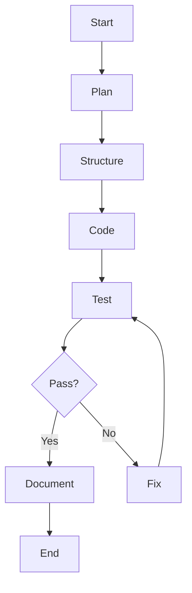

# Example 10: Autonomous Software Agency

A complete, autonomous software development agency simulated using CrewAI Flows and Agents.
It takes a high-level user request and delivers a fully implemented, tested, and documented software project.

## 🚀 Features

- **Hierarchical Crew with Flow Control**: Uses `CrewAI Flow` to manage the lifecycle (Plan -> Code -> Test -> Fix -> Document).
- **Self-Healing**: If tests fail, the flow routes back to the Developer agent to fix the code, up to 3 retries.
- **Project Isolation**: All work is done in `outputs/workspace/` to ensure clean environments.
- **Structured Outputs**: Uses Pydantic models to enforce strict schemas for Plans and Test Results.
- **SQLite MCP Integration**: (Optional) Can log project metadata to a local SQLite "Corporate Memory".

## 🤖 Agents

1.  **Project Manager**: Analyzes requirements and creates a technical plan.
2.  **Solution Architect**: Designs the file structure and dependencies.
3.  **Senior Developer**: Implements the code based on the plan.
4.  **QA Engineer**: Writes and runs `pytest` test suites.
5.  **Technical Writer**: Generates the `README.md`.

## 🛠️ Prerequisites

- Python 3.10+
- OpenAI API Key (or other provider configured in `preferences.yaml`)

## 📦 Installation

1.  Install dependencies:
    ```bash
    pip install -r requirements.txt
    ```

2.  Configure LLM:
    - Edit `config/preferences.yaml` to set your provider and model.
    - Set your API key in environment variables (e.g., `OPENAI_API_KEY`).

3.  Configure MCP (SQLite):
    - The SQLite MCP server is included in `mcp_servers/sqlite_mcp`.
    - `config/mcp_config.json` points to it automatically.

## 🏃 Usage

Run the example with a specific request:

```bash
python src/main.py "Build a fast-api service with one endpoint that returns the current time."
```

Or just run it to use the default example (Hacker News Scraper):

```bash
python src/main.py
```

## 📂 Output

The generated project will be located in `outputs/workspace/`.
Logs are in `log/`.

## 🏗️ Architecture


